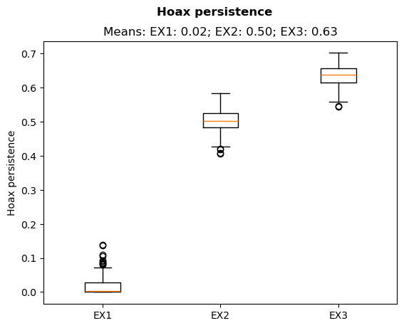
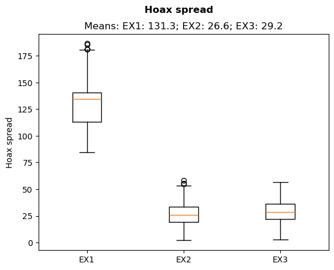
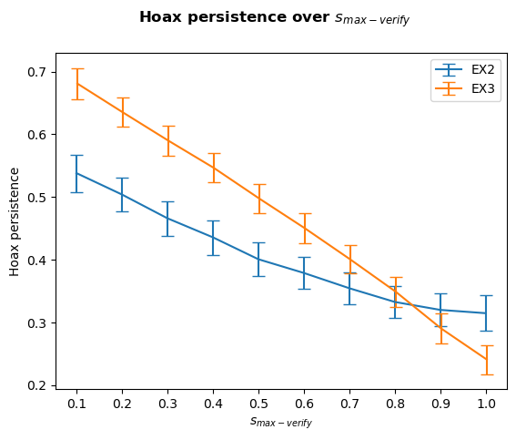
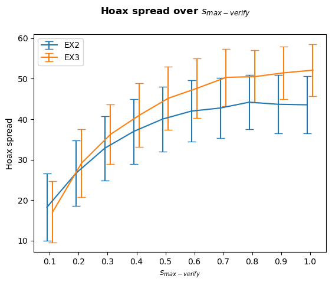

# Modeling Misinformation Diffusion in NetLogo
## The Role of Agent Susceptibility and Fact-Checking Behavior.

## Introduction

This repository contains a NetLogo simulation that augments the work of Sulis and Tambuscio (2020) on hoax diffusion with simulation of heterogenous agent susceptibility factors, non-verifying agents and simulation of anchoring bias. 

## Simulation

The model can be found in `Model/InformationDiffusionProcesModel.nlogo`. This model can be ran in the NetLogo environment. 

## Data

Predefined experiments have been run on the model. The model contains these experiments and their parameters defined in the BehaviourSpace feature of NetLogo. Results  of the experiments can be found in the `Data` folder. Experiments have been ran for 30 repetitions (`Runs30`) and 300 repetitions (`Runs300`) to reduce the effect of stochastic processes. Results of the 300 runs are provided as a ZIP archive due to their large size.

## Analysis

Data analysis code has been provided as a Jupyter notebook in `DataAnalysis.ipynb`. The code has been tested with Python 3.12.3. It requires modules Pandas (2.2.2), NumPy (1.26.4), matplotlib (3.8.4) and SciPy (1.13.1). It loads the CSV from the `Data` folder. So if you want to use the `Runs300` result, make sure to extract the ZIP archive first.

## Results

The following graphs show the derived variables 'hoax persistence' and 'hoax spread' during the different experiments, showing clear effects of the enhanced simulation features.

